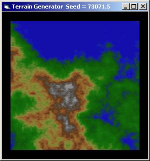



## Terrain Generator 2D

### Description

Generates realistic 2D terrain. Nice to play about with, and might be useful for creators of fantasy related stuff.
 
### More Info
 

             |
---                |---
**Submitted On**   |2002-09-05 07:48:04
**By**             |[Simon  Lynn](https://github.com/Planet-Source-Code/PSCIndex/blob/master/ByAuthor/simon-lynn.md)
**Level**          |Advanced
**User Rating**    |5.0 (35 globes from 7 users)
**Compatibility**  |VB 6\.0
**Category**       |[Graphics](https://github.com/Planet-Source-Code/PSCIndex/blob/master/ByCategory/graphics__1-46.md)
**World**          |[Visual Basic](https://github.com/Planet-Source-Code/PSCIndex/blob/master/ByWorld/visual-basic.md)
**Archive File**   |[Terrain\_Ge127032952002\.zip](https://github.com/Planet-Source-Code/simon-lynn-terrain-generator-2d__1-38675/archive/master.zip)

